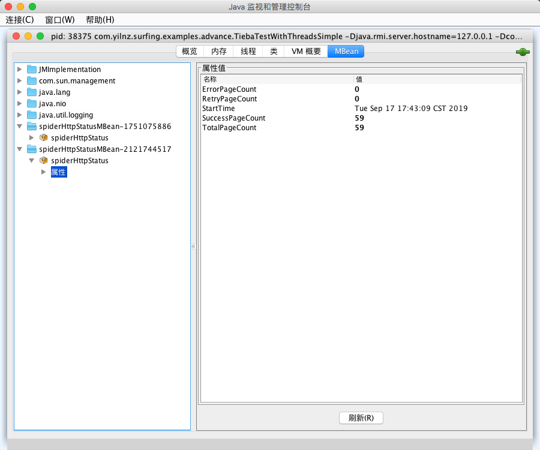

# surfing 

简单易用的爬虫框架，支持 CSS、Regex、XPath、JSONPath 提取文本，也可以发起同步、异步类型的HTTP请求，也支持多线程并发爬取网页。

*新增功能*

+ 文件批量下载
+ JMX监控，可查看成功页面个数、失败页面个数、爬虫开始时间等



# CSS Selector

用CSS选择器获取百度所有链接

``` java
  SurfHttpRequest request = new SurfHttpRequest();
         request.setUrl("http://www.baidu.com");
         request.setMethod("GET");
  final Page page = SurfSprider.create().addRequest(request).request();
  final Selectable select = page.getHtml().select(Selectors.$("a", true));
  final List<Selectable> nodes = select.nodes();
  nodes.forEach(e->{
      System.out.println(e);
  });
```

# Regex Selector

用正则表达式选择器和CSS选择器获取百度所有链接的name属性

```java
SurfHttpRequest request = new SurfHttpRequest();
request.setUrl("http://www.baidu.com");
final Page page = new SurfHttpClient().get(request);
final Selectable select = page.getHtml().select(Selectors.regex("<a.+?>.+?</a>"));
final List<Selectable> nodes = select.nodes();
nodes.forEach(e->{
    System.out.println(e.select(Selectors.$("a", "name")));
});
```

# JsonPath Selector 

```java
   SurfHttpRequest request = new SurfHttpRequest();
         request.setMethod("get");
         request.setUrl("https://jsonplaceholder.typicode.com/posts");
         final Page page = SurfSprider.create().addRequest(request).request();
         final Selectable select = page.getHtml().select(Selectors.jsonPath("$.title"));
         final List<Selectable> nodes = select.nodes();
         nodes.forEach(e->{
             System.out.println(e);
         });
```

# XPath Selector

```java
 SurfHttpRequest request = new SurfHttpRequest();
        request.setUrl("https://www.baidu.com");
        request.setMethod("Get");
        final Page page = SurfSprider.create().addRequest(request).request();
        final Selectable select = page.getHtml().select(Selectors.xpath("//a/text()"));
        final List<Selectable> nodes = select.nodes();
        nodes.forEach(e->{
            System.out.println(e);
        });
```

# 选择器的逻辑连接
选择所有以//开头的a的href和img的src
```java
final SurfHttpRequest surfHttpRequest = new SurfHttpRequest();
surfHttpRequest.setMethod("get");
surfHttpRequest.setUrl("http://www.baidu.com");
final Page page = SurfSprider.create().addRequest(surfHttpRequest).request();
page.getHtml().select(Selectors.$("a", "href")
        .or(Selectors.$("img", "src"))
        .and(Selectors.regex("^//.+"))).nodes().forEach(e->{
    System.out.println(e.get());
});

```

# 多线程并发爬取分页

一次爬5页百度贴吧，并打印帖子主题。

```java
final SurfHttpRequest request1 = new SurfHttpRequest();
request1.setUrl("http://tieba.baidu.com/f?kw=java&fr=index");
request1.setMethod("get");
request1.setData(1);
SurfSprider.create(new PaginationTool("http://tieba.baidu.com/f?kw=java&fr=index&pn=",
        Selectors.$("a.pagination-item:last-of-type", "href")
                .and(Selectors.regex("(?>pn=)(.+)", 1)), 5, 50)).setProcessor(new SurfPageProcessor() {
    @Override
    public Site getSite() {
        return Site.me().setRetryTimes(2).setSleepTime(500);
    }

    @Override
    public void process(Page page) {
        final Html html = page.getHtml();
        html.select(Selectors.$("a.j_th_tit")).nodes().forEach(e->{
            System.out.println("第" + ((int)page.getData() / 50 > 0 ? (int)page.getData() / 50 : 1) + "页->" + e.get());
        });
    }

    @Override
    public void processError(Page page) {
        System.err.println("error page -> " +page.getData());
    }
}).addRequest(request1).start();
```

# 同步请求

**SurfSprider#request**方法会阻塞当前线程，直到返回结果。

```java
 SurfHttpRequest request = new SurfHttpRequest();
    request.setUrl("http://www.baidu.com");
    request.setMethod("GET");
    final Page page = SurfSprider.create().addRequest(request).request();
    System.out.println("同步请求");
```

# 异步请求

**SurfSprider#start**方法不会阻塞当前线程，状态码为200的结果会返回到**PageProcessor**的`process`方法。
```java
final SurfHttpRequest request = new SurfHttpRequest();
		request.setUrl("http://www.baidu.com");
		request.setMethod("GET");
		SurfSprider.create().addRequest(request).setProcessor(new SurfPageProcessor() {
			@Override
			public void process(Page page) {
				System.out.println(page.getHtml().get());
			}
		}).start();
```

非200状态码的结果，在尝试`retryTimes`(默认为2)次都非200后，会返回到**PageProcessor**的`processError`方法，如果传入多个请求，可以设置线程数并发请求，否则是单线程请求(thread默认为1)，每两次请求的间隔时间为`sleepTime`(默认200)毫秒。
```java
 final SurfHttpRequest request = new SurfHttpRequest();
         request.setUrl("https://www.baidu.com");
         request.setMethod("GET");
         final SurfHttpRequest request2 = new SurfHttpRequest();
         request2.setUrl("https://www.baidu.com");
         request2.setMethod("GET");
         final SurfHttpRequest request3 = new SurfHttpRequest();
         request3.setUrl("http://www.baidu.com/s");
         request3.addParams("wd", "java");
         request3.setMethod("GET");
         SurfSprider.create().
                 addRequest(request)
                 .addRequest(request2)
                 .addRequest(request3).thread(5).setProcessor(new SurfPageProcessor() {
             @Override
             public Site getSite() {
                 return Site.me().setRetryTimes(2).setSleepTime(500);
             }
 
             @Override
             public void process(Page page) {
                 System.out.println(page.getUrl());
             }
 
             @Override
             public void processError(Page page) {
                 System.out.println(page.getUrl() +"-- error");
             }
         }).start();
```

# 下载文件

开启5个线程下载百度所有图片

```java
final Html html = SurfSprider.get("http://www.baidu.com").getHtml();
this.urls = html.select(Selectors.$("img", "src")).nodes().stream().map(Selectable::get).collect(Collectors.toList());
SurfSprider.download('/path/to/save/file/', 5, new FileDownloadProcessor() {
        @Override
        public void downloadFinished(DownloadFile downloadFile) {
            System.out.println("downloaded " + downloadFile.getFilename());
        }
}, null, urls.toArray(new String[]{}));
```

# 代理

设置代理分为4个类型：
+ 直接设置单个代理：所有请求都走这个代理
+ 负载均衡代理(LoadBalancingProxyProvider)：请求分别按顺序的使用代理集合中的某一个
+ 高可用代理(HighAvailabilityProxyProvider)：继承自负载均衡代理，请求分别按顺序的使用代理集合中的某一个,请求的代理超过5次未响应将被停止使用
+ 自动代理(AutoProxyProvider)：继承自高可用代理，在高可用代理的基础上，加上了文件缓存，将不可使用的代理写入缓存，下一次运行将不会继续使用

功能性 ： `AutoProxyProvider > HighAvailabilityProxyProvider > LoadBalancingProxyProvider > setProxy`

#### LoadBalancingProxyProviderTest
```java
     HttpProxy[] proxies = new HttpProxy[]{new HttpProxy("http://127.0.0.1:7777"), new HttpProxy("http://192.168.4.99:7777")};
        final SurfHttpRequest request = new SurfHttpRequest();
        request.setUrl("https://www.baidu.com");
        request.setMethod("GET");
        final SurfHttpRequest request2 = new SurfHttpRequest();
        request2.setUrl("https://www.tieba.com");
        request2.setMethod("GET");
        SurfSprider.create().setRequests(Arrays.asList(request, request2)).setProxyProvider(new LoadBalancingProxyProvider(Arrays.asList(proxies))).setProcessor(new SurfPageProcessor() {
            @Override
            public void process(Page page) {
                System.out.println(page.getHtml());
            }
        }).start();
```

#### HighAvaliabilityProxyProviderTest
```java
 HttpProxy[] proxies = new HttpProxy[]{new HttpProxy("http://127.0.0.1:7777"), new HttpProxy("http://192.168.4.99:7777")};
        final SurfHttpRequest request = new SurfHttpRequest();
        request.setUrl("https://www.baidu.com");
        request.setMethod("GET");
        final SurfHttpRequest request2 = new SurfHttpRequest();
        request2.setUrl("https://www.tieba.com");
        request2.setMethod("GET");
        SurfSprider.create().setRequests(Arrays.asList(request, request2)).setProxyProvider(new HighAvaliabilityProxyProvider(Arrays.asList(proxies))).setProcessor(new SurfPageProcessor() {
            @Override
            public void process(Page page) {
                System.out.println(page.getHtml());
            }
        }).start();
```

#### AutoProxyProviderTest
```java
HttpProxy[] proxies = new HttpProxy[]{new HttpProxy("http://127.0.0.1:7777"), new HttpProxy("http://192.168.4.99:7777")};
        final SurfHttpRequest request = new SurfHttpRequest();
        request.setUrl("https://www.baidu.com");
        request.setMethod("GET");
        final SurfHttpRequest request2 = new SurfHttpRequest();
        request2.setUrl("https://www.tieba.com");
        request2.setMethod("GET");
        SurfSprider.create().setRequests(Arrays.asList(request, request2)).setProxyProvider(new AutoProxyProvider(Arrays.asList(proxies))).setProcessor(new SurfPageProcessor() {
            @Override
            public void process(Page page) {
                System.out.println(page.getHtml());
            }
        }).start();
```
# 安装
maven pom引用
```xml
<dependency>
    <groupId>com.yilnz</groupId>
    <artifactId>surfing</artifactId>
    <version>0.1.4</version>
</dependency>
```

# Thanks to
+ [https://github.com/code4craft/webmagic](https://github.com/code4craft/webmagic)
